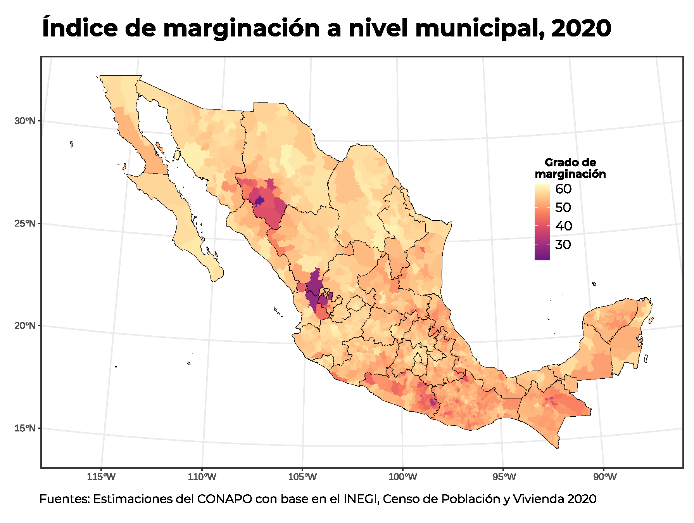
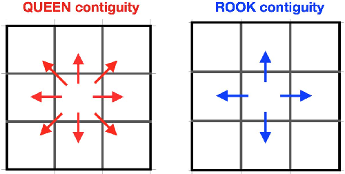
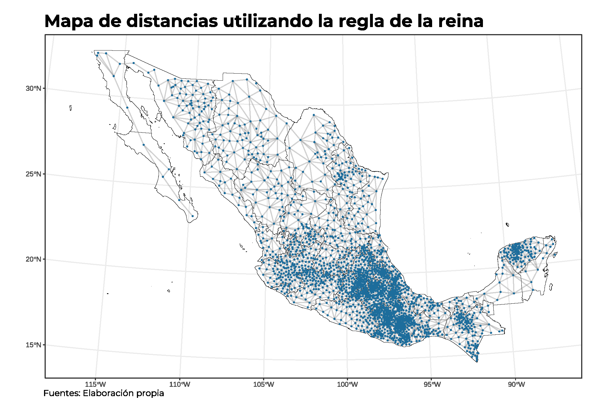
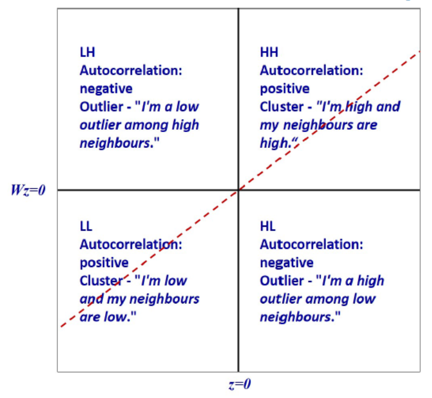
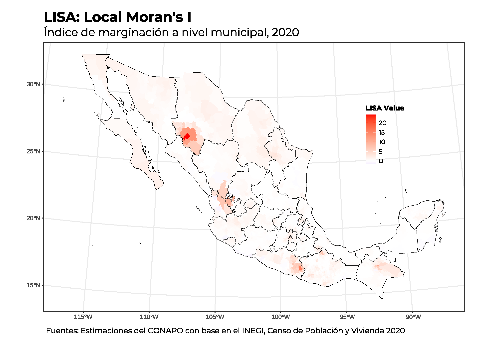
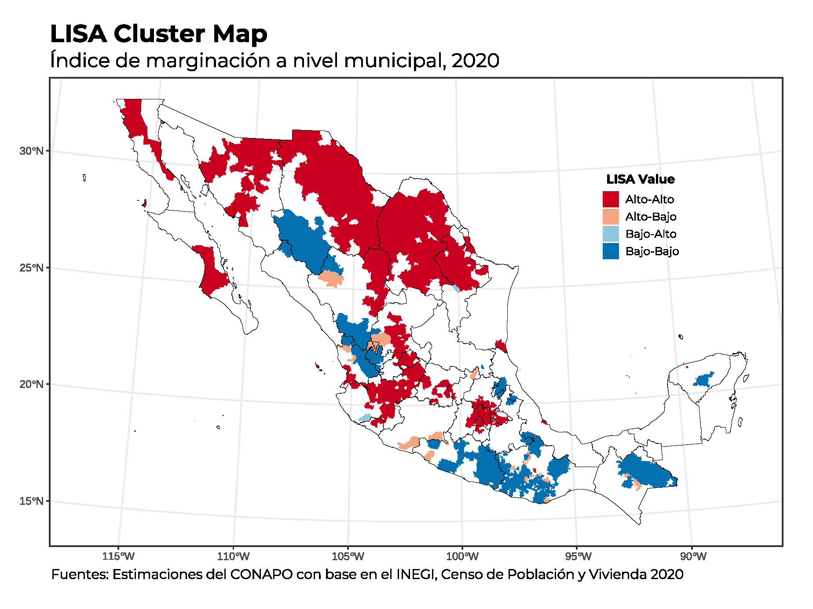

```{=html}
<style type="text/css">
body {
text-align: justify;
font-style: normal;
font-family: "Montserrat";
font-size: 12px
}
h1.title {
  font-size: 40px;
  color: #000D3B;
}
h1 {
  color: #B6854D;
}
h2 {
  color: #172984;
}
h3 {
  color: #172984;
}
</style>
```

```{=html}
<style>
.nav>li>a {
    position: relative;
    display: block;
    padding: 10px 15px;
    color: #1C3BA4
}
.nav-pills>li.active>a, .nav-pills>li.active>a:hover, .nav-pills>li>a:focus {
    color: #ffffff;
    background-color: #09C2BC
}
</style>
```

```{=html}
<style>
.tile1-text {
    position: relative;
    display: block;
    padding: 10px 15px;
    color: #0A6A87;
    list-style: none;
}
.top1-tiles a:nth-of-type(1):hover, .top-tiles1 a:nth-of-type(1):focus{
    color: #ffffff;
    background: #0A6A87
}
</style>
```

```{=html}
<style>
.tile2-text {
    position: relative;
    display: block;
    padding: 10px 15px;
    color: #0A6CC8;
    list-style: none;
}
.top2-tiles a:nth-of-type(1):hover, .top2-tiles a:nth-of-type(1):focus{
    color: #ffffff;
    background: #0A6CC8
}
</style>
```

```{=html}
<style>
.math {
  font-size: 15px;
  color: #B6854D;
}
</style>
```


```{r setup, include=FALSE}
knitr::opts_chunk$set(echo = TRUE, message = FALSE, warning = FALSE, cache = TRUE, 
                      cache.lazy = FALSE, class.source = "fold-show")
knitr::opts_knit$set(root.dir = here::here())
setwd(here::here())
```

```{r,echo=FALSE, eval=FALSE}
rm(list = ls())
```

```{r, echo = FALSE, results=FALSE}
# Paquetes que se usaron en el documento 
require(dplyr)          #A Grammar of Data Manipulation 
require(ggplot2)        # Generar gráficos ggplot y la geometría de un mapa
require(RColorBrewer)
require(ggspatial)
require(ggpubr)
require(knitr)
require(kableExtra)
require(openxlsx)
require(readxl)
require(rgdal)          #Para importar shapefiles. 
require(sp)             # Classes and Methos for Spatial Data
library(spdep)    # Índice de Moran 
require(spdplyr)        #Data manipulation verbs for the sptial classes
require(tidyverse) 
require(unikn)          # Paleta de colores
```

```{r, echo = FALSE, results=FALSE}
# Se descargan las fuentes de la google fonts
require(showtext)
# activar showtext
showtext_auto()
font_add_google("Montserrat", "montserrat")
```

## Objetivo

El análisis espacial es un conjunto de técnicas y herramientas utilizadas para estudiar y comprender patrones, relaciones y procesos geográficos en un contexto espacial. Es decir, se enfoca en cómo los datos se distribuyen en el espacio y cómo se relacionan entre sí, en el cúal se utilizan técnicas como el mapeo, estadística espacial, sistemas de información geográfica (`SIG`)` y la visualización para examinar los datos geográficos y descubrir patrones y relaciones en ellos.

Estas técnicas permiten la detección de patrones y tendencias, la evaluación de la accesibilidad y la conectividad, la modelización de procesos geográficos y la planificación y toma de decisiones basadas en la información geográfica. La cuales sirven como ayuda para campos, como la geografía, planificación urbana, epidemiología, gestión de recursos naturales, criminología y arqueología, entre otros.

## Correlaciones espaciales

Las correlaciones espaciales permiten analizar la relación entre variables geográficas considerando su distribución en el espacio. A diferencia de las correlaciones tradicionales, que suponen independencia entre observaciones, las correlaciones espaciales reconocen que valores cercanos tienden a estar más relacionados que aquellos más alejados, fenómeno conocido como autocorrelación espacial. Este tipo de análisis es fundamental en estudios de patrones geográficos, como la distribución de la pobreza, el acceso a servicios o la dinámica migratoria, y se mide comúnmente mediante indicadores como el `índice de Moran` o la `estadística de Geary`. Su aplicación ayuda a identificar clusters espaciales, entender dinámicas territoriales y mejorar la toma de decisiones en políticas públicas y planificación urbana.

El cálculo de la correlación espacial se basa en la relación entre los valores de una variable y su distribución geográfica. Los métodos más utilizados son el **Índice de Moran** y la **estadística de Geary**, que cuantifican la autocorrelación espacial en diferentes escalas.

### 1. Índice de Moran ($I$)

El **Índice de Moran** mide la autocorrelación espacial global, es decir, qué tan similar es una variable en función de su ubicación. Se calcula como:

$$
I = \frac{N}{W} \times \frac{\sum_{i} \sum_{j} w_{ij} (x_i - \bar{x})(x_j - \bar{x})}{\sum_{i} (x_i - \bar{x})^2}, \quad D : \left\{x \in [-1, 1] \right\}
$$

donde:

\- $N$ es el número total de observaciones,

\- $x_i$ y $x_j$ son los valores de la variable en las ubicaciones $i$ y $j$,

\- $\bar{x}$ es la media de la variable,

\- $w_{ij}$ es la matriz de pesos espaciales que define la relación entre ubicaciones (por ejemplo, vecindad contigua o distancia),

\- $W$ es la suma de todos los pesos espaciales.

El **Índice de Moran** varía entre $-1$ y $1$:

\- $I > 0$ indica correlación positiva (valores similares están agrupados).

\- $I < 0$ indica correlación negativa (valores diferentes están cercanos entre sí).

\- $I \approx 0$ sugiere ausencia de autocorrelación espacial.

### 2. Estadística de Geary ($C$)

La estadística de Geary también mide autocorrelación espacial, pero es más sensible a las diferencias locales. Se calcula como:

$$
C = \frac{(N-1)}{2W} \times \frac{\sum_{i} \sum_{j} w_{ij} (x_i - x_j)^2}{\sum_{i} (x_i - \bar{x})^2}
$$

donde los términos son los mismos que en el Índice de Moran.

El **valor de** $C$ varía entre $0$ y $2$:

\- $C \approx 1$ indica independencia espacial (ausencia de correlación).

\- $C < 1$ sugiere autocorrelación espacial positiva (valores similares están cerca).

\- $C > 1$ indica autocorrelación espacial negativa (valores diferentes están cercanos entre sí).

### 3. Estadística de Getis-Ord ($G_i^*$)

La estadística de **Getis-Ord** $G_i^*$ es una medida local de autocorrelación espacial que identifica clusters de valores altos o bajos en una distribución geográfica. Se usa principalmente para detectar **zonas calientes ("hot spots") y zonas frías ("cold spots")**, lo que la hace útil en análisis de crimen, salud pública, economía y planificación urbana.

#### Fórmula de Getis-Ord $G_i^*$:

$$
G_i^* = \frac{\sum_{j} w_{ij} x_j}{\sum_{j} x_j}
$$

donde:\
- $x_j$ es el valor de la variable en la ubicación $j$,

\- $w_{ij}$ es el peso espacial entre las ubicaciones $i$ y $j$,

\- $\sum_{j} x_j$ es la suma total de la variable en todas las ubicaciones.

Para interpretar los resultados, se suele estandarizar $G_i^*$ en forma de una puntuación $Z$:

$$
Z(G_i^*) = \frac{\sum_j w_{ij} x_j - \bar{X} W_i}{S}
$$

donde:

\- $\bar{X}$ es la media de la variable en toda el área de estudio,

\- $W_i$ es la suma de los pesos espaciales para la ubicación $i$,

\- $S$ es la desviación estándar de la variable en la región.

#### Interpretación de $G_i^*$:

-   $Z(G_i^*) > 1.96$ (p \< 0.05) → Indica un **hot spot** (zona con valores altos agrupados significativamente).\
-   $Z(G_i^*) < -1.96$ (p \< 0.05) → Indica un **cold spot** (zona con valores bajos agrupados significativamente).\
-   $Z(G_i^*) \approx 0$ → No hay patrones espaciales significativos.

#### **Diferencia con el Índice de Moran:**

-   **Moran’s I** mide la autocorrelación espacial **global**, indicando si los valores están agrupados en toda la región.\
-   **Getis-Ord** $G_i^*$ detecta **clusters locales**, permitiendo identificar áreas específicas con concentraciones altas o bajas.

#### **Aplicaciones:**

-   En criminología, para encontrar **zonas de alta delincuencia**.\
-   En epidemiología, para detectar **zonas con alta incidencia de enfermedades**.\
-   En economía, para analizar **concentraciones de riqueza o pobreza**.\
-   En urbanismo, para identificar **áreas de crecimiento acelerado o deterioro urbano**.

Esta estadística es ampliamente utilizada en **Sistemas de Información Geográfica (SIG)** y está implementada en software como **ArcGIS, GeoDa y R** (paquetes `spdep` y `sf`).

## Marco Geoestadístico Nacional (MGN) 2020

El **Marco Geoestadístico Nacional (MGN) 2020** del **Instituto Nacional de Estadística y Geografía (INEGI)** es un sistema de referencia geográfica que define la división territorial de México para la recopilación, análisis y presentación de información estadística. Se utiliza principalmente en censos y encuestas para garantizar la compatibilidad de datos espaciales a nivel nacional.

#### **Características principales del MGN 2020:**

1.  **Unidades geográficas:**
    -   **Áreas Geoestadísticas Estatales (AGEE):** corresponden a los estados.\
    -   **Áreas Geoestadísticas Municipales (AGEM):** coinciden con los municipios.\
    -   **Áreas Geoestadísticas Básicas (AGEB):** subdivisiones de los municipios, utilizadas en zonas urbanas y rurales.\
    -   **Manzanas geoestadísticas:** delimitaciones dentro de las AGEB urbanas.
2.  **Proyección y sistema de coordenadas:**
    -   Utiliza el **Sistema de Referencia Geodésico ITRF2008** en coordenadas geográficas con el **datum WGS84**.\
    -   Se presenta en formato vectorial compatible con SIG (Sistemas de Información Geográfica), en formatos como **Shapefile (SHP)** y **GeoJSON**.

#### Shapefile

La función `readOGR` del paquete `rgdal`, extrae automáticamente la información utilizada por otros paquetes `SIG` de código abierto como QGIS y permite a R manejar una gama más amplia de formatos de datos espaciales. Esta función lee datos `OGR` y datos vectoriales, pero solamente permite manejar capas con características geométricas (no mezcla puntos, líneas o polígonos en una sola capa) y a su vez establecerá un sistema de referencia espacial si la capa tiene dichos metadatos.\
Para leer un archivo `shapefile`, se establecen los siguientes argumentos, como `dsn`, en donde se indica el directorio que contiene los shapes y `layer` que es el nombre explícito de la capa a trabajar y dichas capas deben de ir sin la extensión `.shp`.

A continuación, se lee el archivo .shp que contiene de manera integrada la división de el área geoestadística municipal `agem`.

```{r,results=FALSE,class.source = "fold-show"}
shape_estados <- readOGR(dsn ="D:/MGN/MGN 2020/MGN 2020/conjunto_de_datos", 
                             layer = "00ent",
                              encoding = "UTF-8",
                               use_iconv = TRUE)
```

```{r,results=FALSE,class.source = "fold-show"}
shape_municipios <- readOGR(dsn ="D:/MGN/MGN 2020/MGN 2020/conjunto_de_datos", 
                             layer = "00mun",
                              encoding = "UTF-8",
                               use_iconv = TRUE)
```

La función `rename()` del paquete `dplyr` permite cambiar el nombre de la columna de la clave geoestadística a nivel estatal dentro de la base de datos del shape.

```{r,class.source = "fold-show"}
shape_municipios@data <- shape_municipios@data %>%
                          rename("CVE_GEO" = "CVEGEO")
```

### Base de datos

La base de datos del índice de marginación por municipios se encuentra disponible en la página oficial de [CONAPO](https://www.gob.mx/conapo/documentos/indices-de-marginacion-2020-284372) o bien se puede consultar en la página de [Datos Abiertos](https://datos.gob.mx/) y se presenta en formato `.xlsx` [Consulta](https://datos.gob.mx/busca/dataset/indice-de-marginacion-carencias-poblacionales-por-localidad-municipio-y-entidad).

Para poder trabajar con la base de datos del índice de marginación a nivel municipal, se elimina la fila que contiene los datos a nivel nacional con la función `::filter()` del paquete `dplyr` y por otro lado se cambia el nombre de la columna `CVE_MUN` que hace referencia a la clave geográfica del municipio por `CVE_GEO` para fines prácticos.

```{r, class.source = "fold-show"}
IMM_2020 <- read_xlsx("Bases/IMM_2020.xlsx", sheet = "IMM_2020") %>%
             filter(NOM_ENT != "Nacional") %>%
               mutate(CVE_GEO = CVE_MUN) %>%
                as.data.frame()
```

### SpatialPolygons

Se fusionan los datos del `shape_municipios` con datos estadísticos del índice de marginación a nivel municipal (`IMM_2020`), excluyendo las claves municipales (`CVE_MUN`) y asegurando que `GM_2020` se ordene de acuerdo a los grados de marginación. El resultado es `layer_municipios`, un objeto que contiene a los municipios junto con sus atributos actualizados, lo que facilita su análisis y visualización en mapas.

#### $$SpatialPolygons \Rightarrow SpatialPolygons + Datos$$

```{r, class.source = "fold-show"}
layer_municipios <- merge(shape_municipios,
                           IMM_2020 %>% dplyr::select(c(-CVE_MUN)) %>%
                                         mutate(GM_2020 = fct_relevel(.$GM_2020, "Muy alto", "Alto", "Medio", "Bajo", "Muy bajo")),
                            by = "CVE_GEO")
```

```{r, fig.height=8, fig.width=10, eval = FALSE, class.source = "fold-hide"}
# Paleta de colores 
require(RColorBrewer)
require(ggspatial)
require(ggpubr)

p <- ggplot() + 
      layer_spatial(layer_municipios, aes(fill = IM_2020), color = "transparent") + 
       layer_spatial(shape_estados, fill = "transparent", color = "black") + 
        theme_bw() + 
         theme(plot.title = element_text(size = 22, hjust = 0.15, family = "montserrat", face = "bold"),
               plot.caption = element_text(size = 11, hjust = 0.2, vjust = 1, family = "montserrat"), 
               legend.key.size = unit(0.5, "cm"),
               legend.text = element_text(size = 12, family = "montserrat"), 
               legend.title = element_text(size = 10, hjust = 0.5, family = "montserrat", face = "bold"),
               legend.position = "right"
               ) + 
          scale_fill_viridis_c(option = "A", begin = 0.3, end = 1) +
           scale_color_manual(values = c("#BDBDBD")) + 
            guides(color = guide_legend(override.aes = list(fill = usecol(pal = pal_petrol, n = 5)))) +
     labs(title = "Índice de marginación a nivel municipal, 2020",
           fill = stringr::str_wrap("Grado de marginación", 10), 
            caption = expression(paste("Fuentes: Estimaciones del CONAPO con base en el INEGI, Censo de Población y Vivienda 2020")))
p
path = "Output/Mapa del IMM2020.pdf"
ggexport(p, filename = path ,width = 10, height = 10, device = "cairo")
```


{width="70%" fig-align="center"}


## Centroides

La función `coordinates()` extrae las coordenadas de los centroides de los polígonos en $(x,y)$ de la base de datos espacial y la almacenamos en la variable `coords`, para su posterior uso en el código.

```{r}
# Extrayendo coordenadas desde la base de datos espaciales.
coords = coordinates(layer_municipios)
```

## Tipos de distancias

### Reglas de Vecindad en Análisis Espacial

Existen dos reglas principales para definir vecindades espaciales:

1.  **Regla de la Reina (Queen Contiguity, `queen = TRUE`)**\

    -   Considera que dos polígonos son vecinos si **comparten un vértice o un borde**.\

    -   Es más inclusiva y útil para análisis de fenómenos continuos.

2.  **Regla de la Torre (Rook Contiguity, `queen = FALSE`)**\

    -   Solo considera vecinos a aquellos polígonos que **comparten un borde completo** (no solo un vértice).

    -   Es más restrictiva y útil cuando se analizan estructuras en cuadrículas.

3.  **Estructura de vecindad espacial basada en los** $𝑘- vecinos$ más cercanos.

    -   Este método usa la distancia euclidiana en el espacio de coordenadas (latitud y longitud) para determinar los $k$ vecinos más cercanos.

**Comparación con otros métodos de vecindad**

| Método | Criterio de Vecindad | Tipo de Distancia |
|------------------|-----------------------------|-------------------------|
| `poly2nb(..., queen=TRUE)` | Regla de la Reina (borde o vértice) | Topológica |
| `poly2nb(..., queen=FALSE)` | Regla de la Torre (solo borde) | Topológica |
| `knn2nb(knearneigh(coords, k))` | $k$ vecinos más cercanos | Euclidiana |



**Cálculo del máximo número de enlaces posibles**

Si hay $n$ municipios, el número máximo de conexiones en una red completamente conectada sería:

$$
    \frac{n \times (n - 1)}{2}
    $$

donde cada municipio se conecta con todos los demás **sin contar conexiones repetidas** (es decir, sin contar dos veces el mismo par de municipios).

Para $n = 2469$ municipios en la red:

$$
    \frac{2469 \times (2469 - 1)}{2} = \frac{2469 \times 2468}{2} = 3,045,846
    $$

Entonces, en una red **completamente conectada**, habría **3,045,846 enlaces**.

### Queen contiguity

-   `X_nb_queen` almacena la lista de vecinos generada por `poly2nb()` usando la regla de la reina, con el parámetro `queen = TRUE`.
-   Es un objeto de clase *nb* (neighborhood), que es una estructura que se utiliza para representar relaciones espaciales en análisis de datos espaciales.

```{r}
# Construyendo lista de vecinos con criterio tipo reina
X_nb_queen = poly2nb(layer_municipios, queen = TRUE)  
summary(X_nb_queen)
```

El resultado describe la estructura de vecindad espacial generada usando la regla de la **reina** para los municipios en el objeto `X_nb_queen`. Vamos a desglosarlo:

-   Se indica que hay 14428 enlaces espaciales no nulos entre los municipios. Un enlace no nulo significa que dos municipios son considerados vecinos según la regla de la reina (comparten un borde o vértice). En otras palabras, el número total de enlaces (14428) es relativamente pequeño en comparación con el número total de posibles enlaces (que sería mucho mayor si cada municipio estuviera conectado con todos los demás municipios).

-   Aproximadamente el 24% de los enlaces posibles entre los municipios son vecinos. Es decir, solo un pequeño porcentaje de los posibles pares de municipios están conectados por un enlace de vecindad.

-   Cada municipio, en promedio, está conectado con aproximadamente 5.84 municipios vecinos. Es decir, la mayoría de los municipios tienen alrededor de 5-6 vecinos, pero hay 3 municipios muy conectados (hasta 22 vecinos) y otros muy aislados (solo un vecino).

**Comparación con el resultado actual**

En la red de vecindad (con la regla de la reina), hay **14,428 enlaces**, lo que representa:

$$
    \frac{14,428}{3,045,846} \times 100 = 0.47% 
    $$

Solo **el 0.47% de los enlaces posibles existen**, lo que indica que la red de vecindad es muy **dispersa** en comparación con una red completamente conectada.


### Rook contiguity

`X_nb_rook` es una lista de vecindad espacial basada en la regla del torre (Rook Contiguity) en lugar de la regla de la reina, con el parámetro `queen = FALSE`.

```{r}
# Construyendo lista de vecinos con criterio  tipo torre
X_nb_rook = poly2nb(layer_municipios, queen = FALSE) 
summary(X_nb_rook)
```

📌 En comparación con `X_nb_queen`, esta red de vecindad tiene **menos enlaces**, lo que confirma que hay municipios que solo compartían vértices y que ahora no se consideran vecinos.

-   Se indica que hay 14,200 conexiones entre municipios. Es un poco menor que en `X_nb_queen` (14,428 enlaces), lo que indica que se eliminaron enlaces que solo ocurrían en los vértices. 

-   Aproximadamente el 23.29% de los pares posibles de municipios están conectados. Es decir, solo un pequeño porcentaje de los posibles pares de municipios están conectados por un enlace de vecindad.

-   Cada municipio, en promedio, está conectado con aproximadamente 5.75 vecinos por municipio en promedio. Es decir, la mayoría de los municipios tienen alrededor de 5-6 vecinos, pero había 3 municipios con 22 enlaces. Ahora, solo hay 1 municipio con 22 enlaces. 
- Esto indica que algunos municipios perdieron conexiones al aplicar la regla del torre, pero el municipio más conectado sigue teniendo el mismo número máximo de enlaces.   

En la red de vecindad (con la regla de la torre), hay **14,200 enlaces**, lo que representa:

$$
    \frac{14,200}{3,045,846} \times 100 = 0.46% 
    $$

Solo **el 0.46% de los enlaces posibles existen**, lo que indica que la red de vecindad es muy **dispersa** en comparación con una red completamente conectada y menor al utilizar la regla de la torre.


### k-neighbours contiguity  

`X_kn4` se crea una lista de vecinos basada en la proximidad de coordenadas usando el método de los $k$ vecinos más cercanos (*k*-nearest neighbors, KNN) con $k = 5$.   

```{r}
# Construyendo lista de vecinos con k-vecinos más cercanos
IDs = row.names(as(layer_municipios, "data.frame")) # Id de las filas
X_kn4 = knn2nb(knearneigh(coords, k = 5), row.names = IDs) 
X_kn4
```

-   Se indica que hay 12 345 conexiones entre municipios. - Como se usó \( k = 5 \), cada municipio tiene **exactamente 5 vecinos**, lo que da un total de:  
  \[
    2469 \times 5 = 12 345
    \]
- **A diferencia de `X_nb_queen` o `X_nb_rook`**, donde el número de vecinos varía, aquí **todos tienen exactamente 5 vecinos**.  

-   Aproximadamente el **el 20% de los pares posibles de municipios están conectados**. Es decir, es menor que en `X_nb_queen` (**23.67%**) y `X_nb_rook` (**23.29%**), lo que tiene sentido porque aquí cada municipio tiene un número fijo de vecinos menor que el promedio en los otros métodos.

-   Cada municipio, está conectado por **5 vecinos por municipio en promedio**. Es decir, esto es **esperado**, ya que en `knn2nb(k = 5)`, cada municipio tiene exactamente 5 vecinos.  

- **En `X_nb_queen` y `X_nb_rook`, el promedio era ~5.8 vecinos** porque dependía de la geometría de los municipios.

En la red de vecindad (con k - vecinos), hay **12 345 enlaces**, lo que representa:

$$
    \frac{12 345}{3 045 846} \times 100 = 0.40% 
    $$

Solo **el 0.40% de los enlaces posibles existen**, lo que indica que la red de vecindad es muy **dispersa** en comparación con una red completamente conectada y menor al utilizar la regla de la reina o torre. 


### **📊 Comparación con `X_nb_queen` y `X_nb_rook`**    
  
  
  | Método                           | Vecinos por municipio (promedio) | Total de enlaces | Relación simétrica |
  |----------------------------------|:------------------------------:|:----------------:|----------------------|
  | Regla de la Reina (`X_nb_queen`) | 5.84                           | 14,428           | ✅ Sí | |
  | Regla del Torre (`X_nb_rook`)    | 5.75                           | 14,200           | ✅ Sí |
  | KNN con \( k = 4 \) (`X_kn4`)    | 5                              | 12,345            | ❌ No |             


```{r, eval = FALSE, class.source = "fold-hide"}
library(ggplot2)
library(sf)
library(spdep)
library(ggspatial)
library(viridis)


#plot(layer_municipios, border = 'lightgrey')
#plot(X_nb_queen, coords, pch = 19, cex = 0.6, add = TRUE, col = "red")

# Se convierten los layer_municipios y centroides a sf (spatial features)
target_crs <- st_crs(layer_municipios) # Extraer CRS original
coords_sf <- st_as_sf(as.data.frame(coords), coords = c("V1", "V2"), crs = target_crs)

# Se obtienen los enlaces de vecinos en formato de líneas
nb_lines <- unlist(
            lapply(1:length(X_nb_queen), function(i) {
              if (length(X_nb_queen[[i]]) > 0) {
                lapply(X_nb_queen[[i]], function(j) {
                  st_linestring(rbind(coords[i, ], coords[j, ]))
                })
              } else {
                NULL
              }
            }), recursive = FALSE
          )

nb_lines_sf <- st_sfc(nb_lines, crs = target_crs)

# Se convierten los enlaces de líneas a un sf object
graph_sf <- st_as_sf(nb_lines_sf, crs = target_crs)

# Crear el gráfico
p <- ggplot() +
      layer_spatial(data = shape_estados, fill = "transparent", color = "black") +
       geom_sf(data = graph_sf, color = "#7f7f7f", size = 0.3, alpha = 0.2) +  # Líneas de vecinos
        geom_sf(data = coords_sf, color = "#1d6d9c", size = 0.6) +  # Puntos de los municipios
         theme_bw() +
          theme(plot.title = element_text(size = 22, hjust = 0.15, family = "montserrat", face = "bold"),
                plot.subtitle = element_text(size = 20, hjust = 0.15, family = "montserrat", face = "bold"),
                plot.caption = element_text(size = 11, hjust = 0.5, vjust = 1, family = "montserrat"),
                legend.key.size = unit(0.5, "cm"),
                legend.text = element_text(size = 12, family = "montserrat"),
                legend.title = element_text(size = 10, hjust = 0.5, family = "montserrat", face = "bold"),
                legend.position = "right"
                ) +
            labs(title = "Mapa de distancias utilizando la regla de la reina",
                 caption = expression(paste("Fuentes: Elaboración propia"))
            )
p

path = paste0(here::here(), "/Output/Mapa de distancias.pdf")
ggexport(p, filename = path ,width = 10, height = 10, device = "cairo")
```

{width="70%" fig-align="center"}

## Ponderaciones

Construcción de la matriz de ponderaciones espacial (asignar pesos a las áreas que están vinculadas). Los pesos espaciales son clave para representar relaciones espaciales, mejorar análisis estadísticos y realizar predicciones más realistas en modelos geoespaciales. 

Para considerar la estructura de vecindad y los efectos espaciales en la estimación de los parámetros se especifica una matriz cuadrada (`W`) denominada matriz de pesos o matriz de ponderaciones, cuyos elementos no negativos dan evidencia de la intensidad de la interdependencia existente entre cada par de unidades geográficas $i$ y $j$.

`nb2listw` (Pesos espaciales para listas de vecinos): Complementa una lista de vecinos con pesos espaciales para el esquema de codificación elegido.

Por defecto, `nb2listw()` asigna **pesos estandarizados por fila (row-standardized weights)**:  
  \[
    w_{ij} = \frac{1}{N_i}
    \]
donde \( N_i \) es el número de vecinos del municipio \( i \).  

📌 **Esto significa que la suma de los pesos de cada fila es 1**, lo que ayuda a evitar que municipios con más vecinos dominen el análisis.

---
  
### **🔹 Diferentes Estilos de Pesos**  

Puedes cambiar el estilo de ponderación con el argumento `style`:
  
| Estilo (`style`) | Explicación |
|------------------|-------------|
| `"B"` (Binario) | 1 si son vecinos, 0 si no lo son |
| `"W"` (Row-standardized, **default**) | Cada peso es \( 1 / N_i \) |
| `"S"` (Suma de filas igual a 1) | Normaliza para evitar sesgos por diferencias en el número de vecinos |
| `"U"` (Varianza unitaria) | Pondera para obtener varianza constante en las filas |


Ejemplo en `R`:  

```{r, echo = TRUE, eval = FALSE}
X_nbq_w_bin = nb2listw(X_nb_queen, style = "B")  # Pesos binarios
X_nbq_w_std = nb2listw(X_nb_queen, style = "W")  # Pesos estándar (default)
X_nbq_w_sum = nb2listw(X_nb_queen, style = "S")  # Normalización por suma
```

---
  

### Queen contiguity 

Se convierte `X_nb_queen` en una **lista** (lista de pesos espaciales), que es la estructura que `R` usa en análisis espaciales como **Moran’s I o modelos espaciales**.


```{r}
#   Matriz de pesos normalizados en fila 
# usando QUEEN(W) (Tipo reina):
X_nbq_w = nb2listw(X_nb_queen)
X_nbq_w
```

### Rook contiguity

Se convierte `X_nb_rook` en una **lista** (lista de pesos espaciales), que es la estructura que `R` usa en análisis espaciales como **Moran’s I o modelos espaciales**.

```{r}
#   Matriz de pesos normalizados en fila 
# usando ROOK(W) (Tipo torre):
X_nbr_w = nb2listw(X_nb_rook)
X_nbr_w
```
### k-neighbours contiguity

Se convierte `X_kn4` en una **lista** (lista de pesos espaciales), que es la estructura que `R` usa en análisis espaciales como **Moran’s I o modelos espaciales**.

```{r}
#   Matriz de pesos normalizados en fila usando k = 5(W):
X_kn4_w = nb2listw(X_kn4)
X_kn4_w
```


Resumen estadístico de la matriz de pesos para cada criterio

```{r}
summary(unlist(X_nbq_w$weights))  # Criterio reina
```

```{r}
summary(unlist(X_nbr_w$weights))  # Criterio torre
```

```{r}
summary(unlist(X_kn4_w$weights))  # Criterio k-vecinos
```

## Índice de Moran:

Evaluando existencia de autocorrelación espacial

El **Índice de Moran** varía entre -1 y 1:   
  - **\( I > 0 \)** indica correlación positiva (valores similares están agrupados).   
- **\( I < 0 \)** indica correlación negativa (valores diferentes están cercanos entre sí).  
- **\( I \approx 0 \)** sugiere ausencia de autocorrelación espacial.   

`moran.test`: (Prueba `I de Moran` para autocorrelación espacial) Utiliza una matriz de ponderaciones espaciales en forma de lista de ponderaciones. La opción alternativa especifica la hipótesis alternativa, debe ser mayor (predeterminado), menor o como en este caso, bilateral (`two.side`).  


### Queen contiguity

```{r}
# Regla de la reina:
Ind_Moran_queen = moran.test(layer_municipios$IM_2020, 
                             listw = X_nbq_w, 
                             alternative = "two.side")
Ind_Moran_queen
```


- **Moran I statistic = 0.6465**. Indica una fuerte **autocorrelación espacial positiva**. Los municipios con valores altos de `IM_2020` tienden a estar cerca de otros municipios con valores altos, y los municipios con valores bajos tienden a estar cerca de otros municipios con valores bajos.    

- **Expectation = -0.0004**. Es el valor esperado de Moran I bajo la hipótesis nula (aleatoriedad espacial).  Un valor muy cercano a 0, indica que **sin autocorrelación, esperaríamos valores cercanos a 0**.  

- Significancia estadística **p-value < 2.2e-16**. Indica que la probabilidad de obtener un Moran I tan alto por azar es **prácticamente 0**. Por lo tanto se rechaza la hipótesis nula, es decir, hay evidencia estadísticamente significativa de autocorrelación espacial en `IM_2020`.    

### Rook contiguity

```{r}
# Regla de la torre
Ind_Moran_rook = moran.test(layer_municipios$IM_2020, 
                            listw = X_nbr_w, 
                            alternative = "two.side")
Ind_Moran_rook
```

- **Moran I sigue siendo alto (~0.647 en ambos casos)**.Existe una fuerte **autocorrelación espacial positiva**.  
- **El Z-score es similar (~53 en ambos casos)**.La evidencia de autocorrelación espacial es estadísticamente significativa.  
- **El p-valor sigue siendo < 2.2e-16**.La autocorrelación observada **no es aleatoria**.  


### k-neighbours contiguity

```{r}
# k-veciono con k = 5:
Ind_Moran_k = moran.test(layer_municipios$IM_2020, 
                         listw = X_kn4_w, 
                         alternative = "two.side") 
Ind_Moran_k
```


- **Moran I más alto (0.6605 vs. ~0.646)** → Mayor **dependencia espacial entre municipios** cuando se usa k-vecinos.  
- **Z-score más alto (55.253 vs. ~53)** → Mayor fuerza estadística en la relación espacial.  
- **p-valor sigue siendo < 2.2e-16** → **Autocorrelación altamente significativa**, no es aleatoria.  


#### 📊 **Resumen de los resultados**  

| Regla de Vecindad | Moran I | Standard Deviate | p-valor |
  |-------------------|---------|------------------|---------|
  | **Queen (X_nbq_w)** | **0.6465** | **53.168** | **< 2.2e-16** |
  | **Rook (X_nbr_w)**  | **0.6469** | **52.78**  | **< 2.2e-16** |
  | **k-Vecinos (k = 5, X_kn4_w)** | **0.6605** | **55.253** | **< 2.2e-16** | 
  

### Moran test  

Tanto `moran()` como `moran.test()` están relacionadas con el cálculo del Índice de Moran I, pero tienen propósitos distintos.   

Utilizando la función `moran()`, calcula Moran I y además realiza una prueba de hipótesis para determinar si la autocorrelación espacial es estadísticamente significativa.

```{r}
Moran_Test <- moran(layer_municipios$IM_2020, listw = X_nbq_w, length(X_nbq_w), Szero(X_nbq_w))
Moran_Test
```

- Indice de Morán, tiene un  **valor obtenido: `0.0007855639`**. Un valor cercano a 0, indica **muy poca o nula autocorrelación espacial** en los datos.    

- Factor de normalización **K = 7.847273**. Este valor es **un factor de normalización** utilizado en cálculos internos de Moran I. No tiene una interpretación directa, pero se usa para estandarizar el resultado. 


Recordemos La autocorrelación espacial positiva se presenta cuando valores altos [bajos] de la variable de estudio en una localización están asociados con valores altos [bajos] en las regiones vecinas. De manera que la tasa de pobreza en los diferentes puntos se va a presentar de forma similar y esto afirma la posible existencia de clústeres.


### Prueba del estadístico I de Moran

Se calcula un pseudo `p-value` determinando, la proporción de los valores I de Moran local generados a partir de permutaciones que muestran más agrupaciones que los datos originales. Si esta proporción (el pseudo valor p) es pequeña (menos de 0.05), puede concluir que sus datos muestran agrupaciones estadísticamente significativas.

`moran.mc`: Realiza una prueba de permutación de Monte Carlo para evaluar la significancia estadística del Índice de Moran I. Esto es útil para confirmar si la autocorrelación espacial observada es real o podría haber ocurrido por azar.

#### Queen contiguity

```{r}
moran.mc(layer_municipios$IM_2020, listw = X_nbq_w, nsim = 1000) # Reina
```
-  `statistic = 0.64652` (Índice de Moran I observado)** el valor es **positivo y alto (~0.5 - 1)**, indica una **fuerte autocorrelación espacial positiva**. Esto significa que **los municipios con valores similares del índice IM_2020 tienden a agruparse en el espacio geográfico**.  

- Si el valor fuera cercano a 0, no habría autocorrelación espacial, y si fuera negativo, los valores disímiles estarían dispersos.    
- **`p-value = 0.001` (Nivel de significancia estadística)**. Como el `p-value` es **menor que 0.05**, rechazamos la hipótesis nula de que **la autocorrelación espacial observada es producto del azar**. En otras palabras, **existe una agrupación espacial significativa de municipios con valores similares de IM_2020**.   

#### Rook contiguity

```{r}
moran.mc(layer_municipios$IM_2020, listw = X_nbr_w, nsim  =1000) # Torre
```

- El **p-valor es menor que 0.05**, lo que indica que la autocorrelación espacial observada **no es aleatoria**. Específicamente, como `p < 0.001`, podemos decir que **la evidencia de autocorrelación espacial es extremadamente fuerte**.  

- **Valor:** `0.64693.  Como el **valor del estadístico es positivo y alto (~0.5 - 1)**, indica **fuerte autocorrelación espacial positiva**.  Esto significa que **los municipios con valores similares de IM_2020 tienden a agruparse cuando se usa la vecindad tipo torre**.    


#### k-neighbours contiguity

```{r}
moran.mc(layer_municipios$IM_2020, listw = X_kn4_w, nsim = 1000) # K-vecinos
```
- El estadístico de Moran I: 066055, sigue siendo **positivo y alto (~0.5 - 1)**, lo que indica **una fuerte autocorrelación espacial positiva**.  En este caso, el índice **es aún mayor** que con las reglas de la reina (`0.64652`) y la torre (`0.64693`), lo que sugiere **una mayor concentración espacial de valores similares** bajo esta definición de vecindad.  
- Esto puede deberse a que la regla de k-vecinos **incluye siempre exactamente 5 vecinos**, independientemente de la geografía y los límites administrativos.  


Dado que el p-value para cada método o criterio es igual a 0.001, y este valor es menor a 0.05, significa que se muestran agrupaciones estadísticamente significativas.  


### 📌 Comparación entre métodos de vecindad

| Vecindad | Moran I | p-valor |
|----------|---------|---------|
| **Reina** (queen) | 0.64652 | `< 0.001` |
| **Torre** (rook) | 0.64693 | `< 0.001` |
| **k-vecinos (k=5)** | 0.66055 | `< 0.001` |
  
  
## Prueba C de Geary:  

El test de Geary: `C` es una prueba estadística utilizada para evaluar la **autocorrelación espacial** en los datos. Mientras que el **Índice de Moran I** mide la **autocorrelación global** (es decir, si los valores de una variable se agrupan o dispersan en todo el espacio), el `Geary C` se centra en las diferencias locales entre vecinos. 


El índice de Geary (`C`) es un índice de comparaciones por pares entre las diferentes zonas; por lo general varía entre 0 y 2. 

El **valor de** $C$ varía entre $0$ y $2$:

\- $C \approx 1$ indica independencia espacial (ausencia de correlación).

\- $C < 1$ sugiere autocorrelación espacial positiva (valores similares están cerca).

\- $C > 1$ indica autocorrelación espacial negativa (valores diferentes están cercanos entre sí).


`geary.test`: (Prueba `C` de Geary para autocorrelación espacial).Utiliza una matriz de ponderaciones espaciales en forma de lista de ponderaciones. La opción alternativa especifica la hipótesis alternativa, debe ser mayor (predeterminado), menor o como en este caso, bilateral (two.side).

### Queen contiguity

```{r}
# Regla de la reina:
geary.test(layer_municipios$IM_2020, listw = X_nbq_w, alternative = "two.side")
```

- **Valor:** `0.35505`.  El valor de **Geary C** **cerca de 0** indica **una fuerte autocorrelación espacial positiva**, ya que **valores cercanos a 0** sugieren que los valores similares están más agrupados entre los vecinos. En términos generales, este valor es **significativamente bajo**, lo que indica una tendencia a más similitud espacial entre los municipios vecinos.

- El **p-value es extremadamente bajo (< 2.2e-16)** (mucho menor que 0.05) indicando que se puede **rechazar la hipótesis nula** de que no hay autocorrelación espacial. Es decir, sugiere que los valores de IM_2020 están agrupados espacialmente de manera significativa, con municipios cercanos que muestran un comportamiento similar en cuanto al valor de IM_2020.


### Rook contiguity

```{r}
# Regla de la torre
geary.test(layer_municipios$IM_2020, listw = X_nbr_w, 
                             alternative = "two.side")
```

- El valor de **Geary C (`0.35505`) es considerablemente bajo**, lo que indica que los valores de `IM_2020` se agrupan más de lo que se esperaría por azar.
- El **p-valor extremadamente bajo (< 2.2e-16)** sugiere que **esta agrupación espacial es altamente significativa**. Esto refuerza la idea de que los municipios con valores similares en IM_2020 están agrupados** en el espacio y que esta agrupación es **significativa**.


### k-neighbours contiguity  

```{r}
# k-vecinos, k = 5:
geary.test(layer_municipios$IM_2020, listw = X_kn4_w, 
                         alternative = "two.side") 
```

- **El test de Geary C con k-vecinos (k = 5)** confirma la presencia de **autocorrelación espacial positiva** en los datos de `IM_2020`.
- El valor de **Geary C (`0.32368`) es aún más bajo** que en los análisis anteriores (Reina y Torre), lo que indica que **hay una agrupación espacial más fuerte** bajo la vecindad de **k-vecinos**.
- El **p-valor extremadamente bajo (< 2.2e-16)** sugiere que **la autocorrelación espacial es altamente significativa**.


### Comparación entre las tres definiciones de vecindad:   
- **Vecindad de Reina (queen):** `Geary C = 0.35505`
- **Vecindad de Torre (rook):** `Geary C = 0.35505`
- **k-vecinos (k = 5):** `Geary C = 0.32368`


### Prueba del estadístico C de geary  

- **`geary.test()`**: Basado en aproximaciones asintóticas, puede ser más rápido pero menos flexible en ciertas situaciones.

- **`geary.mc()`**: Utiliza simulaciones y es más **robusto** y **preciso**, especialmente en presencia de distribuciones no normales o datos atípicos.

#### Queen contiguity 

```{r}
geary.mc(layer_municipios$IM_2020, listw = X_nbq_w, nsim = 999) # Reina
```

- El test de **Geary C usando simulaciones de Monte Carlo** indica que hay una **autocorrelación espacial positiva significativa** en los datos de `IM_2020` para los municipios.
- **El valor observado de Geary C (0.35579)** es mucho **más bajo** que el valor esperado bajo la hipótesis nula, lo que significa que los municipios cercanos tienen **valores más similares** en comparación con lo que sería esperado aleatoriamente.
- El **p-valor (0.001)** es **muy pequeño**, lo que confirma que esta autocorrelación es significativa.
- El **ranking de 1** también sugiere que el valor observado es **más bajo** que en todas las simulaciones aleatorias generadas.


#### Rook contiguity 

```{r}
geary.mc(layer_municipios$IM_2020, listw = X_nbr_w, nsim = 999) # Torre
```

 - El test de **Geary C usando simulaciones de Monte Carlo** muestra que hay una **autocorrelación espacial positiva significativa** en los valores de `IM_2020` de los municipios, es decir, los municipios cercanos tienen **valores similares** en comparación con lo que sería esperado por azar.
- El valor observado de **Geary C (0.35505)** es **más bajo** que lo esperado bajo la hipótesis nula, lo que refuerza la presencia de **autocorrelación espacial positiva**.
- El **p-valor (0.001)** es **muy pequeño**, lo que indica que la autocorrelación observada es **estadísticamente significativa**.
- El **ranking de 1** sugiere que el valor observado es **el más bajo** entre las simulaciones, lo que significa que la **agregación espacial de los valores** es mucho mayor de lo que sería aleatorio.


#### k-neighbours contiguity 

```{r}
geary.mc(layer_municipios$IM_2020, listw = X_kn4_w, nsim = 999) # K-vecinos
```

- El test de **Geary C utilizando simulaciones de Monte Carlo** con la configuración de **k-vecinos (k=4)** muestra que existe una **autocorrelación espacial positiva significativa** entre los valores de `IM_2020` de los municipios.
- El valor observado de **Geary C (0.32368)** es **bajo**, lo que indica que los municipios cercanos tienen **valores similares** en `IM_2020`, lo que implica una **autocorrelación espacial positiva**.
- El **p-valor (0.001)** es **muy pequeño**, lo que significa que la **autocorrelación observada es estadísticamente significativa**.
- El **ranking de 1** sugiere que el valor observado de **Geary C** es **el más bajo** entre las simulaciones, lo que indica que los valores son más **similares** de lo que sería esperado si no existiera autocorrelación.


Dado que el p-value para cada método o criterio es igual a 0.001, y este valor es menor a 0.05, significa que se muestran agrupaciones estadísticamente significativas.

### Prueba G(d) de Getis y Ord

- **`geary.mc()`**: Es más útil para detectar **autocorrelación local** y analizar cómo las diferencias entre valores cercanos se comportan. Está más orientado a evaluar cómo se distribuyen los valores en relación con sus vecinos cercanos. Se usa generalmente cuando se quiere analizar si las **valores cercanos** son más similares o más dispersos entre sí.

- **`globalG.test()`**: Es adecuado cuando se quiere evaluar la presencia de **agrupamientos espaciales globales** en un área geográfica, es decir, ver si hay **agrupamientos significativos de valores extremos (altos o bajos)** en todo el espacio. Se usa cuando el interés es encontrar **puntos calientes o fríos** dentro de la región geográfica.

#### k-neighbours contiguity

```{r}
# Ahora, usando k = 5:
globalG.test(layer_municipios$IM_2020, listw = X_kn4_w, alternative = "two.side") 
```

- Dado que el **p-valor es extremadamente bajo (< 2.2e-16)**, se **rechaza la hipótesis nula** y se concluye que **hay una agrupación espacial significativa** de los valores en el conjunto de datos. 
- Sin embargo, el valor del **Global G observado** (cercano a cero) sugiere que no existe una **concentración fuerte de valores altos o bajos**. Este valor cercano a cero indica que los valores **no están fuertemente agrupados** en áreas de valores extremos (como puntos calientes o fríos), pero aún así, la estructura espacial **no es aleatoria**, lo que podría sugerir un patrón débil de agrupación.  

  

## Gráfico de dependencia espacial

Un gráfico de dispersión que permite analizar la autocorrelación espacial global, es el denominado **Scatterplot de Moran univariante (Anselin, 1993)** . Este gráfico se construye en un plano cartesiano, en el eje de abscisas se ubican los valores de la variable de estudio estandarizada (x), y en el eje de ordenadas, se ubican los valores del retardo espacial de la variable estandarizada. 

- Si la nube de puntos tiende a formarse sobre la diagonal principal del plano cartesiano (cuadrante I y III, en contra de las manecillas de reloj), esto nos indicará la presencia de autocorrelación espacial positiva.

- Si la nube de puntos tiende a ubicarse sobre la diagonal secundaria del plano cartesiano (cuadrante II y IV, en contra de las manecillas de reloj) , será un indicio de existencia de autocorrelación espacial negativa.

- De lo contrario, si la nube de puntos de distribuye sobre los cuatro cuadrantes, esto nos indicará ausencia de autocorrelación espacial.

{width="50%" fig-align="center"}

Utilizando la función `moran.plot` perite generar una gráfica de datos espaciales frente a sus valores espaciales rezagados,  al informar el resumen de las medidas de influencia para la relación lineal entre los datos y el rezago.


```{r, fig.height=5, fig.width=7, eval = TRUE, class.source = "fold-hide"}
require(ggrepel)

mp <- moran.plot(layer_municipios$IM_2020, 
                 listw = X_kn4_w, 
                 main = "Scatterplot de Moran para la pobreza", 
                 labels = unique(IMM_2020$CVE_MUN), 
                 plot = FALSE)

ggplot(mp, aes(x = x, y = wx)) + 
 geom_point(shape = 1, 
            color = "#0e4669", 
            alpha = 0.5) + 
  geom_smooth(formula = y ~ x, method = "loess") + 
   geom_smooth(formula = y ~ x, 
               method = "lm", 
               se = FALSE, 
               colour = "lightblue") + 
     geom_hline(yintercept = mean(mp$wx), lty = 2) + 
      geom_vline(xintercept = mean(mp$x), lty = 2) + 
       geom_point(data = mp[mp$is_inf,], aes(x = x, y = wx), shape = 9, color = "#777777") +
        geom_text_repel(data = mp[mp$is_inf,], 
                         aes(x = x, 
                             y = wx, 
                             label = labels, 
                             vjust = 1.5)) +
         theme_bw() + 
          theme(plot.title = element_text(size = 22, hjust = 0, family = "montserrat", face = "bold"),
                plot.caption = element_text(size = 11, hjust = 0.2, vjust = 1, family = "montserrat"), 
                text = element_text(family = "montserrat"), 
                legend.key.size = unit(0.5, "cm"),
                legend.text = element_text(size = 12, family = "montserrat"), 
                legend.title = element_text(size = 10, hjust = 0.5, family = "montserrat", face = "bold"),
                legend.position = "none"
               ) +   
         labs(title = "Gráfico de dependencia espacial",
              subtitle = "Índice de marginación a nivel municipal",
              y = "Rezago espacial de los municipios",
              x = "Municipios")


```


Dado que la nube de puntos tiende a formarse sobre la diagonal principal del plano cartesiano (cuadrante I y III), esto indica la presencia de autocorrelación espacial positiva.

## Indicador Local de Autocorrelación Espacial (LISA):

Anselin (1995) se refirió a esto como una estadística “LISA”, El **Indicador Local de Autocorrelación Espacial (LISA)** permite identificar la **autocorrelación espacial** a nivel local, es decir, en qué medida una unidad espacial (por ejemplo, municipio o vecindad) está asociada a sus vecinos cercanos en términos de alguna variable de interés. El cálculo de LISA se puede realizar con el paquete `spdep` en R.


`localmoran`: La estadística local espacial I de Moran se calcula para cada zona en función del objeto de ponderaciones espaciales.

`lag.listw`: Usando una representación dispersa de listw de una matriz de ponderaciones espaciales, calcula el vector de retardo. 

```{r, fig.height=6, fig.width=8, eval = FALSE, class.source = "fold-hide"}
# Calcular LISA usando localmoran()
LISA_result <- localmoran(layer_municipios$IM_2020, X_nbq_w)

# Agregar los resultados de LISA al objeto espacial
layer_municipios <- layer_municipios %>% 
                     mutate(LISA = LISA_result[,1]) 

p <-  ggplot() +
       layer_spatial(layer_municipios, aes(fill = LISA), color = "transparent") + 
        layer_spatial(shape_estados, fill = "transparent", color = "black") + 
         scale_fill_gradient2(low = "blue", mid = "white", high = "red", midpoint = 0) +
          theme_bw() + 
           theme(plot.title = element_text(size = 20, hjust = 0, family = "montserrat", face = "bold"),
                 plot.subtitle = element_text(size = 16, hjust = 0, family = "montserrat"),
                 plot.caption = element_text(size = 11, hjust = 0.2, vjust = 1, family = "montserrat"), 
                 legend.key.size = unit(0.5, "cm"),
                 legend.text = element_text(size = 9, family = "montserrat"), 
                 legend.title = element_text(size = 10, hjust = 0.5, family = "montserrat", face = "bold"),
                 legend.position = "right"
                   ) + 
            labs(title = "LISA: Local Moran's I", 
                 subtitle = "Índice de marginación a nivel municipal, 2020",
                 fill = "LISA Value",
                 caption = expression(paste("Fuentes: Estimaciones del CONAPO con base en el INEGI, Censo de Población y Vivienda 2020")))
 
path = "Output/Mapa de LISA.pdf"
ggexport(p, filename = path ,width = 10, height = 10, device = "cairo")
```
{width="70%" fig-align="center"}

### Cluster map 

```{r, fig.height=6, fig.width=8, eval = FALSE, class.source = "fold-hide"}
LISA_result <- localmoran(layer_municipios$IM_2020, listw = X_nbq_w)

layer_municipios@data  <- layer_municipios@data %>% 
                            mutate(pvalue = LISA_result[,5],
                                   cX = .$IM_2020 - mean(IM_2020)) %>% # IM - Media(IM) 
                             mutate(lagDV = lag.listw(X_nbq_w, .$IM_2020)) %>% # Calcula el rezago (promedios)
                              mutate(clagDV = .$lagDV - mean(lagDV)) %>% # Rezago - Media(Rezago)
                               mutate(quadrant = case_when(.$cX > 0 & .$clagDV > 0 & .$pvalue <= 0.05 ~ "Alto-Alto", 
                                                           .$cX < 0 & .$clagDV < 0 & .$pvalue <= 0.05 ~ "Bajo-Bajo",
                                                           .$cX < 0 & .$clagDV > 0 & .$pvalue <= 0.05 ~ "Bajo-Alto",
                                                           .$cX > 0 & .$clagDV < 0 & .$pvalue <= 0.05 ~ "Alto-Bajo") 
                                      ) %>% 
                                mutate(quadrant = fct_relevel(.$quadrant, c("Alto - Alto", "Bajo - Bajo", "Bajo - Alto", "Alto - Bajo")))
           
p <- ggplot() +
      layer_spatial(layer_municipios, aes(fill = quadrant), color = "transparent") + 
       layer_spatial(shape_estados, fill = "transparent", color = "black") + 
        scale_fill_manual(values = pals::brewer.rdbu(4),  na.value = "transparent") +
         theme_bw() + 
          theme(plot.title = element_text(size = 20, hjust = 0, family = "montserrat", face = "bold"),
                plot.subtitle = element_text(size = 16, hjust = 0, family = "montserrat"),
                plot.caption = element_text(size = 11, hjust = 0.2, vjust = 1, family = "montserrat"), 
                legend.key.size = unit(0.5, "cm"),
                legend.text = element_text(size = 9, family = "montserrat"), 
                legend.title = element_text(size = 10, hjust = 0.5, family = "montserrat", face = "bold"),
                legend.position = "right"
                   ) + 
          labs(title = "LISA Cluster Map", 
               subtitle = "Índice de marginación a nivel municipal, 2020",
               fill = "LISA Value",
               caption = expression(paste("Fuentes: Estimaciones del CONAPO con base en el INEGI, Censo de Población y Vivienda 2020")))

path = "Output/Mapa de clusters.pdf"
ggexport(p, filename = path, width = 10, height = 10, device = "cairo")
```

{width="70%" fig-align="center"}


## Referencias

Anselin, L. (1995). Local Indicators of Spatial Association—LISA. Geographical Analysis, 27(2), 93–115.

Datos Abiertos de México - Índice de marginación (carencias poblacionales) por localidad, municipio y entidad. (2021). Retrieved February 13, 2022, from <https://datos.gob.mx/busca/dataset/indice-de-marginacion-carencias-poblacionales-por-localidad-municipio-y-entidad>

Bivand, R. S., Pebesma, E., & Gómez-Rubio, V. (2013). Applied Spatial Data Analysis with R (2nd ed.). Springer.

RPubs - Spatial Clustering of Univariate Geographically Referenced Attribute. (2020). Retrieved January 30, 2025, from <https://rpubs.com/erikaaldisa/spatialclustering>


## Librerías

**Librerías que se usaron en el trabajo** 

```{r, collapse=FALSE}
sesion_info <- devtools::session_info()
```

```{r, echo = FALSE}
kable(dplyr::select(tibble::as_tibble(sesion_info$packages %>% dplyr::filter(attached == TRUE)),
                    c(package, loadedversion, source))) %>%
   kable_classic(full_width = TRUE, html_font = "montserrat", font_size = 10) 
```

<a rel="license" href="http://creativecommons.org/licenses/by/4.0/"></a><br />This work by [**Diana Villasana Ocampo**]{xmlns:cc="http://creativecommons.org/ns#" property="cc:attributionName"} is licensed under a <a rel="license" href="http://creativecommons.org/licenses/by/4.0/">Creative Commons Attribution 4.0 International License</a>.

